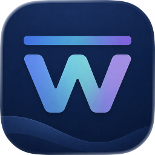
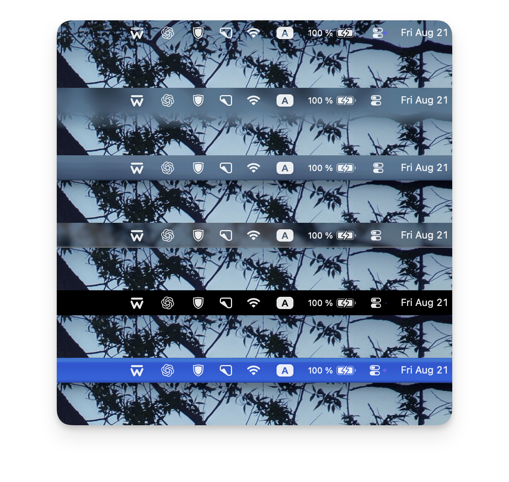
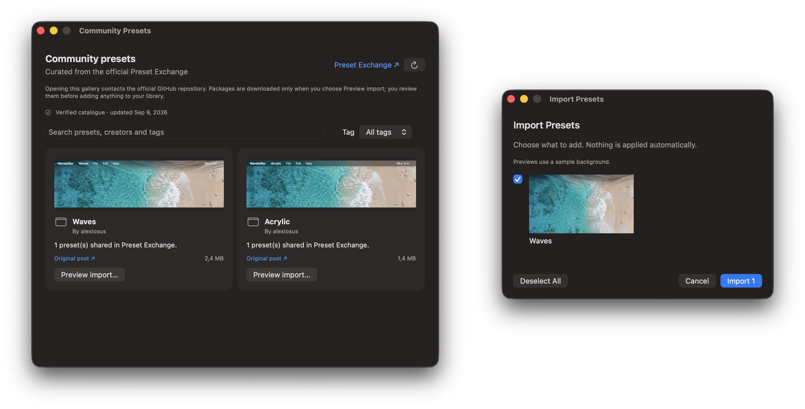
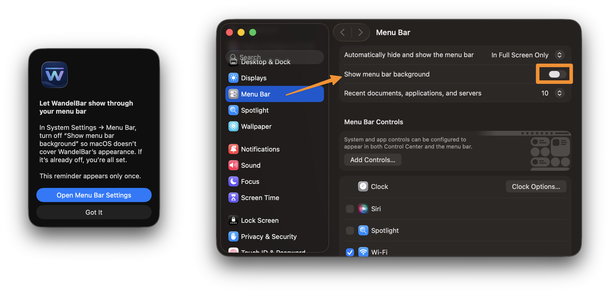
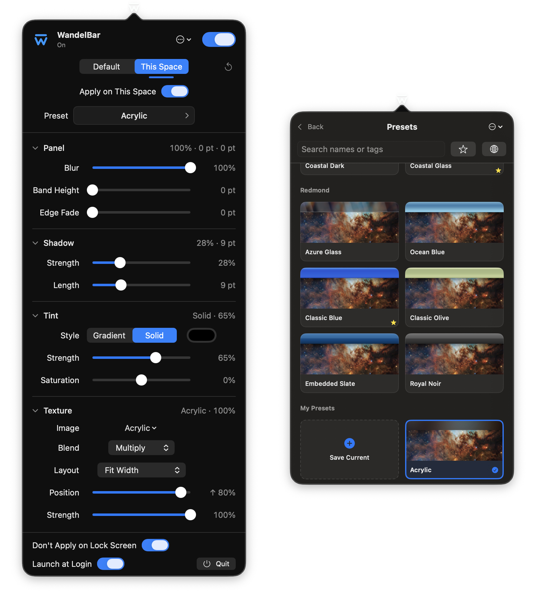

<p align="center">
  
</p>

<h1 align="center">WandelBar</h1>

<p align="center">
  <strong>Build your own background for the macOS menu bar.</strong><br>
  Restore contrast, soften a busy wallpaper, or give the bar a completely different character.
</p>

<p align="center">
  
  
  
  <a href="LICENSE"></a>
</p>

<p align="center">
  
</p>

WandelBar is a native macOS utility that turns the strip behind the menu bar into a customizable
part of the desktop. It works with your current wallpaper and lets you add blur, tint, shadow,
texture, and other treatments without replacing the menu bar itself.

## Why it exists

macOS Tahoe hides the menu bar background by default. The cleaner appearance works on some
wallpapers, but on bright or detailed images it can make menu bar icons and text difficult to read.

There is currently a system setting that brings the background back, but it offers one fixed result
and may change along with future versions of macOS. WandelBar started as a way to restore contrast
without depending on that single system treatment. It soon became something broader: a way to make
the bar fit the wallpaper, recreate an older desktop style, or design an entirely personal surface.

The name is a bilingual wordplay: the German adjective *wandelbar* means “changeable,” while the
app makes the menu bar itself changeable.

> [!NOTE]
> WandelBar is designed primarily for macOS Tahoe. It can run on macOS 14 Sonoma and later, but on
> releases before Tahoe the system menu bar background cannot be disabled. It therefore covers most
> of WandelBar's treatment, leaving little practical reason to use the app there.

## What you can customize

- **Surface:** blur radius, band height, edge fade, shadow strength, and shadow length.
- **Color:** solid or gradient tint, custom tint color, opacity, and saturation.
- **Texture:** bundled or imported PNG, JPEG, and HEIC images with blend, layout, position, and
  strength controls.
- **Scope:** use one design as the default or create an explicit override for the current desktop
  Space.
- **System behavior:** launch at login, keep the original wallpaper on the lock screen, and enable or
  disable the effect at any time.

Changes are rendered as you make them. WandelBar follows wallpaper, display, and Space changes, and
restores the original wallpaper when the effect is turned off.

## Preset catalog

### See the [complete preset catalog](docs/PRESETS.md).

The visual catalog previews every preset on the current wallpaper, so you can compare treatments
before applying one.

The app includes **26 built-in presets** across four collections:

| Collection | Style |
| --- | --- |
| **Basic** | Flexible starting points from a subtle wash to clear blur |
| **Color & Tone** | Dark glass, solid bars, monochrome, vivid color, and tinted treatments |
| **Cupertino** | Striped surfaces, metallic glass, and coastal translucent treatments |
| **Redmond** | Glossy blue, olive, slate, and noir treatments with a retro PC character |

Every preset remains fully editable after it is applied. Use the **Save Current** card to capture
your changes as a personal preset. Presets in **My Presets** can be renamed or deleted directly from
their cards.

Search presets by name or personal tags, use the star to show favorites, or **Undo** the last
preset application. **Manage Textures…** removes custom textures that are no longer in use.

### Share complete preset packages

Export personal presets and their custom textures as one `.wandelbar-presets` file. Import previews
the contents and lets you choose what to add without overwriting or applying existing presets.

**Share to Discussions…** prepares a GitHub post, a package and a preview using the sample or current
wallpaper. Drag the attachments into the draft together, review it and publish when ready.
See the [sharing guide](docs/SHARING.md).

### Community Gallery

Click the **globe beside the favorites star** to browse approved community packages, enlarge their
previews and choose presets to import. Browsing requires no GitHub account.

Packages come from the official
[Preset Exchange](https://github.com/alexiosus/WandelBar/discussions/categories/preset-exchange)
and are verified before import. Read [how approval works](docs/COMMUNITY.md).

<p align="center">
  
</p>

## Download and install

Download the latest DMG from [GitHub Releases](https://github.com/alexiosus/WandelBar/releases).

1. Open the downloaded `.dmg` file.
2. Drag **WandelBar** to **Applications**.
3. Open **WandelBar** from Applications.

WandelBar is signed with Developer ID and notarized by Apple. Download official builds only from
[alexiosus/WandelBar](https://github.com/alexiosus/WandelBar).

See the [changelog](CHANGELOG.md) for what's new.

Use **Options (⋯) → Check for Updates…** to update without downloading a new DMG manually.
Automatic checks and installation are optional; enable them in **Update Settings**.

Current release builds support Apple silicon Macs (`arm64`). macOS Tahoe still supports a small
number of Intel Macs, but an Intel release is not currently provided.

### Homebrew

Install from the official project tap:

```sh
brew tap alexiosus/wandelbar https://github.com/alexiosus/WandelBar
brew install --cask alexiosus/wandelbar/wandelbar
```

You can update from within WandelBar, or run
`brew upgrade --cask --greedy alexiosus/wandelbar/wandelbar`.

## Getting started

1. Open WandelBar. On macOS Tahoe, turn off **System Settings → Menu Bar → Show menu bar background**.
   WandelBar shows a one-time reminder with a button to open this panel.

   

2. Click WandelBar's icon in the menu bar.
3. Turn the app on. WandelBar saves the original wallpaper before applying its first effect.
4. Open **Preset** and choose a starting point, or adjust the controls manually.
5. Use **Default** for the shared design, or **This Space** for the current desktop Space.
6. Optionally enable **Launch at Login** or **Don't Apply on Lock Screen**.

> [!NOTE]
> If the wallpaper is stored in a protected folder such as Downloads or Pictures, macOS may ask
> WandelBar for access to that folder. This is expected: the permission lets the app read the
> wallpaper file so it can generate previews and apply treatments. WandelBar does not use it to
> browse unrelated files.

Opening `WandelBar.app` again while the app is already running brings the existing settings popover
forward.

<p align="center">
  
</p>

## Build from source

To build and package WandelBar locally:

```sh
git clone https://github.com/alexiosus/WandelBar.git
cd WandelBar
./Scripts/package_app.sh
open Build/WandelBar.app
```

The script creates `Build/WandelBar.app`. It uses an available Developer ID certificate when there
is exactly one, or an ad-hoc signature when none is installed. Local packaging alone does not
notarize the app. To create a DMG:

```sh
./Scripts/create_dmg.sh
```

### Requirements

- An Apple silicon Mac for prebuilt releases
- macOS 14 Sonoma or later; macOS Tahoe is strongly recommended
- A still-image wallpaper or a Photos wallpaper that can be exported locally
- Swift 6 when building from source

## How it works

WandelBar finds the wallpaper assigned to each active display and Space, renders a screen-sized copy
with a Core Image treatment across the top, and asks macOS to use the generated image as the desktop
wallpaper. The app modifies a copy; it never edits the source image.

Saved originals, generated wallpapers, and textures live under
`~/Library/Application Support/WandelBar`; settings and presets are stored in the app's local
preferences. Rendering happens locally and off the main thread.

## Privacy

WandelBar has no accounts or analytics. Rendering and personal settings stay on your Mac.
The optional Community Gallery downloads content from GitHub, which receives normal connection
information such as your IP address. It does not upload your wallpaper or local settings.

Sharing prepares local files for you to publish yourself. Packages include custom textures;
current-wallpaper previews also include the visible wallpaper image. Photos access is requested
only when needed to export a wallpaper from your library.

**About WandelBar…** includes the app version, official links, [Ko-fi support](https://ko-fi.com/alexiosus)
and third-party notices.

## Disk usage

WandelBar removes its unused generated wallpapers, but macOS may retain large cached copies.
**Options (⋯) → Maintenance → Clean up macOS wallpaper cache automatically** can remove known old WandelBar
copies. It is **off by default** and may prompt for access to data from other apps when enabled.
Current wallpapers and unrelated files are preserved; older, untracked cache files are left alone.

## Limitations

- WandelBar uses undocumented SkyLight APIs and macOS wallpaper-store data to identify active Spaces
  and their wallpaper sources. These internals can change in a macOS update.
- Full-screen Spaces are left untouched because the public desktop API cannot address them
  independently.
- Video and animated wallpapers, including Aerials and the animated Macintosh wallpaper, are not
  supported. WandelBar detects them and leaves the desktop unchanged instead of replacing the moving
  wallpaper with a still frame.
- Photos shuffle and live-provider configurations cannot be reconstructed through the public desktop
  API. While WandelBar is active, the currently visible Photos asset is treated as a still image.
- macOS chooses light or dark menu bar content based on wallpaper brightness. An unusually bright
  treatment can therefore change the system icon appearance.

## Development

```sh
swift build
swift test
./Scripts/package_app.sh
```

Contributions are welcome. See [CONTRIBUTING.md](CONTRIBUTING.md) for the project layout and
bug-reporting checklist.

## Trademark notice

WandelBar is an independent project and is not affiliated with, sponsored by, or endorsed by
Apple Inc. macOS is a trademark of Apple Inc., registered in the U.S. and other countries and
regions. The WandelBar name, logo, and app icon are reserved for official builds; forks and modified
distributions should use different branding. See the [branding policy](BRANDING.md) for details.

## License

WandelBar's source code and documentation are free software licensed under the
[GNU General Public License version 3](LICENSE) only (`GPL-3.0-only`), except where otherwise noted.
Copyright © 2026 Alexey Eremeev.
