# WandelBar preset catalog

WandelBar includes 26 built-in presets. A preset is a starting point rather than a locked theme:
after applying one, every effect control remains editable.

[Back to the main README](../README.md)

## Original wallpaper

Every preview below uses the same wallpaper, making it easier to see exactly what each preset
changes.

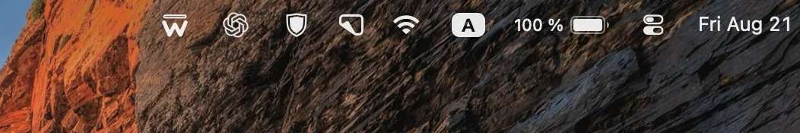

## Basic

Flexible treatments intended to work with almost any wallpaper.

<table>
  <tr>
    <td width="50%" valign="top">
      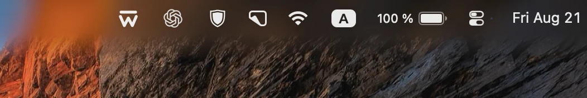 
      <strong>Default</strong> 
      A balanced dark gradient with moderate blur and a soft transition into the wallpaper.
    </td>
    <td width="50%" valign="top">
      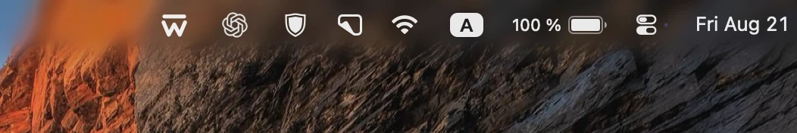 
      <strong>Subtle</strong> 
      Light blur, a restrained dark wash, and a short edge fade.
    </td>
  </tr>
  <tr>
    <td width="50%" valign="top">
      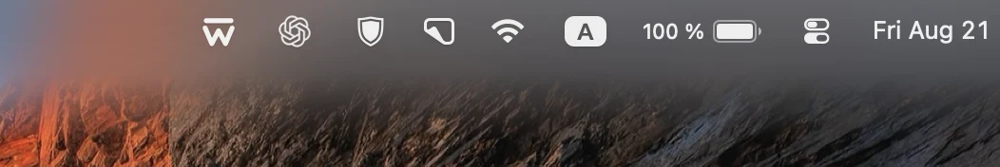 
      <strong>Frosted</strong> 
      Strong cool-toned blur, reduced saturation, and a broad feathered edge.
    </td>
    <td width="50%" valign="top">
      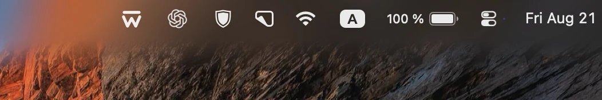 
      <strong>Clear Blur</strong> 
      Blur without tint, preserving the wallpaper's original color.
    </td>
  </tr>
</table>

## Color & Tone

Treatments built primarily from color, contrast, and saturation.

<table>
  <tr>
    <td width="50%" valign="top">
      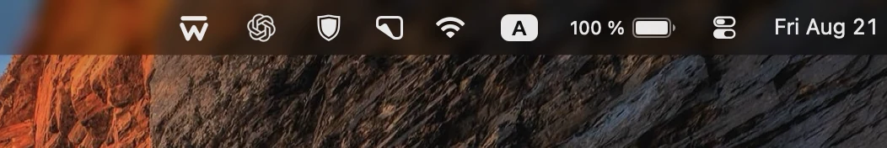 
      <strong>Smoked Glass</strong> 
      Compact charcoal glass with a crisp edge and stronger color beneath it.
    </td>
    <td width="50%" valign="top">
      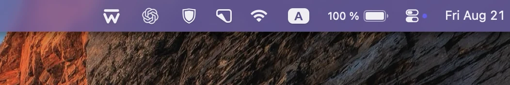 
      <strong>Amethyst</strong> 
      Opaque violet glass with a pronounced lower shadow.
    </td>
  </tr>
  <tr>
    <td width="50%" valign="top">
      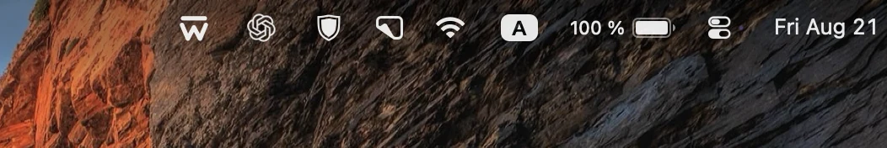 
      <strong>Dim</strong> 
      A dark fading wash without blur for wallpapers that need contrast rather than softness.
    </td>
    <td width="50%" valign="top">
      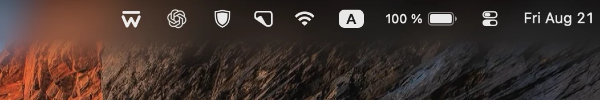 
      <strong>Dark</strong> 
      Heavy blur and a deep gradient for bright or visually busy wallpapers.
    </td>
  </tr>
  <tr>
    <td width="50%" valign="top">
      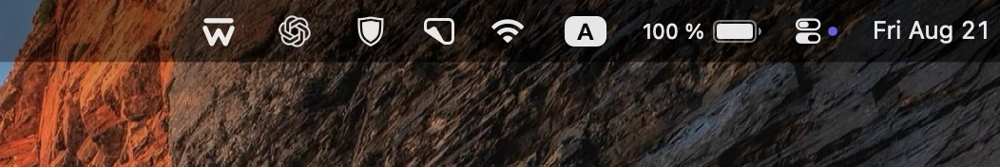 
      <strong>Translucent Bar</strong> 
      A uniform black layer that still lets the wallpaper show through.
    </td>
    <td width="50%" valign="top">
      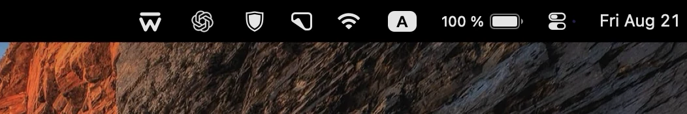 
      <strong>Black Bar</strong> 
      A fully black, hard-edged menu bar background.
    </td>
  </tr>
  <tr>
    <td width="50%" valign="top">
      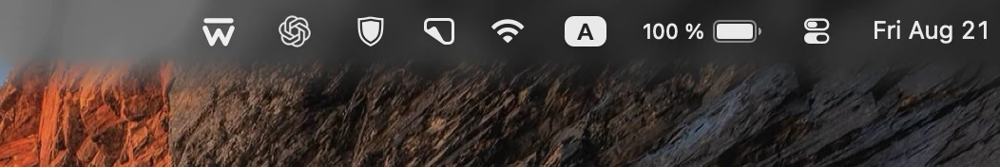 
      <strong>Monochrome</strong> 
      Soft blur with the color removed from the bar region.
    </td>
    <td width="50%" valign="top">
      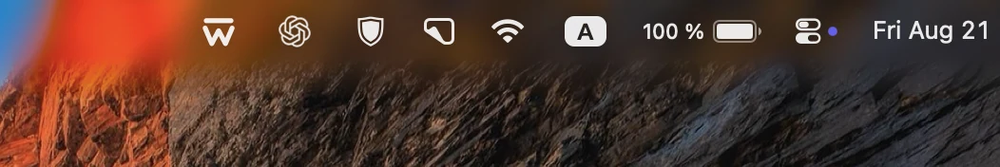 
      <strong>Vivid</strong> 
      Gentle blur, amplified wallpaper color, and a slight dark wash.
    </td>
  </tr>
</table>

## Cupertino

Texture-led treatments with striped, metallic, and translucent surfaces.

<table>
  <tr>
    <td width="50%" valign="top">
      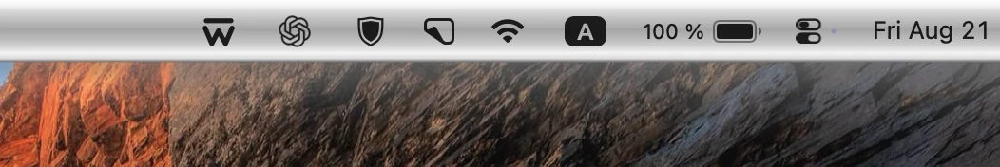 
      <strong>Striped Light</strong> 
      Bright monochrome stripes with a defined lower shadow.
    </td>
    <td width="50%" valign="top">
      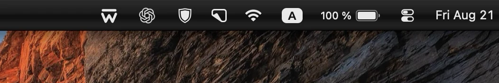 
      <strong>Striped Dark</strong> 
      A near-black striped surface with a faint highlight.
    </td>
  </tr>
  <tr>
    <td width="50%" valign="top">
      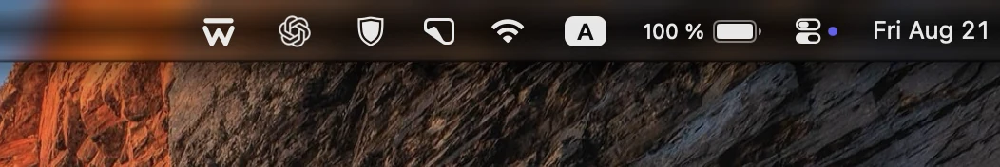 
      <strong>Striped Glass</strong> 
      A darker, wallpaper-aware variation of the striped texture.
    </td>
    <td width="50%" valign="top">
      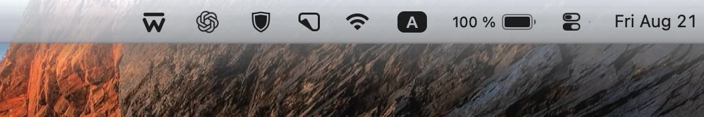 
      <strong>Silver Glass</strong> 
      Pale metallic glass, muted color, and a classic shadowed edge.
    </td>
  </tr>
  <tr>
    <td width="50%" valign="top">
      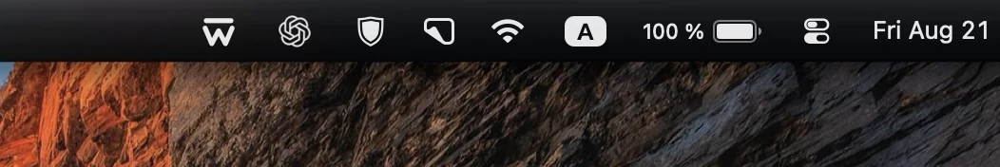 
      <strong>Graphite Glass</strong> 
      Deep blurred metal with a graphite finish.
    </td>
    <td width="50%" valign="top">
      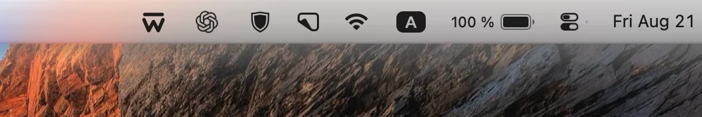 
      <strong>Coastal Light</strong> 
      A lightly tinted, high-contrast translucent surface.
    </td>
  </tr>
  <tr>
    <td width="50%" valign="top">
      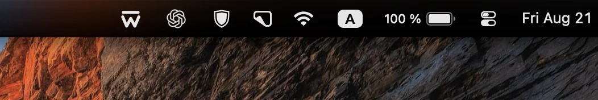 
      <strong>Coastal Dark</strong> 
      Dark soft-light texture with strong blur and a crisp silhouette.
    </td>
    <td width="50%" valign="top">
      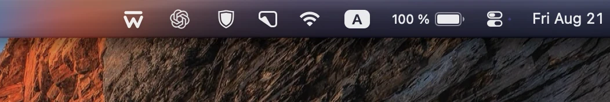 
      <strong>Coastal Glass</strong> 
      A cool blue, wallpaper-aware variation of the coastal texture.
    </td>
  </tr>
</table>

## Redmond

Glossy and color-forward treatments with a retro PC character.

<table>
  <tr>
    <td width="50%" valign="top">
      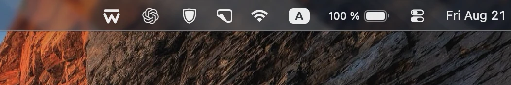 
      <strong>Azure Glass</strong> 
      Dark blue glass with a restrained reflective highlight.
    </td>
    <td width="50%" valign="top">
      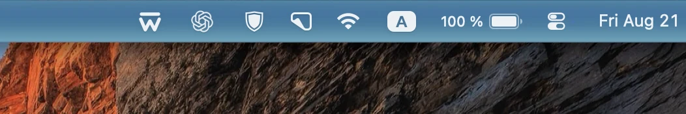 
      <strong>Ocean Blue</strong> 
      A brighter polished-blue strip with a glossy surface.
    </td>
  </tr>
  <tr>
    <td width="50%" valign="top">
      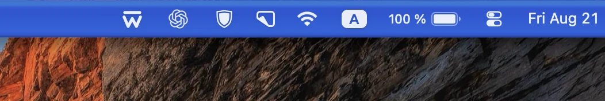 
      <strong>Classic Blue</strong> 
      A familiar saturated-blue treatment with a crisp lower edge.
    </td>
    <td width="50%" valign="top">
      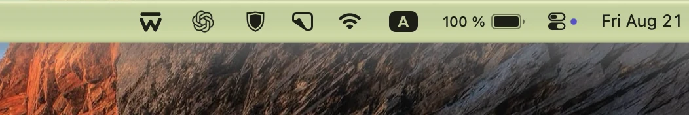 
      <strong>Classic Olive</strong> 
      A muted olive-green treatment with classic desktop chrome.
    </td>
  </tr>
  <tr>
    <td width="50%" valign="top">
      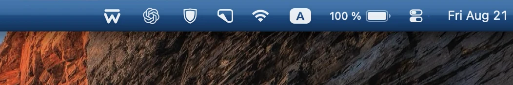 
      <strong>Embedded Slate</strong> 
      A hard-edged slate bar using its original texture colors.
    </td>
    <td width="50%" valign="top">
       
      <strong>Royal Noir</strong> 
      A dramatic glossy black texture.
    </td>
  </tr>
</table>

## Create and manage personal presets

Open the preset catalog and select **Save Current** to capture the settings you are currently using.
If the name already exists, WandelBar asks whether to replace that preset. Personal presets appear in
**My Presets**; hover over a card to reveal controls for renaming or deleting it.

A preset stores the complete treatment: blur geometry, fade or shadow, tint mode and color,
saturation, texture, blend mode, strength, layout, and vertical position. It does not modify or
contain the wallpaper itself.

## Import and export

Use the import and export buttons in the catalog header to move personal presets between Macs or
share them with other WandelBar users.

Export creates one `.wandelbar-presets` file containing the selected presets and any custom textures
they use. Import shows a preview before making changes. Name conflicts are preserved safely with an
`(Imported)` suffix, and imported presets are added to **My Presets** without being applied.
