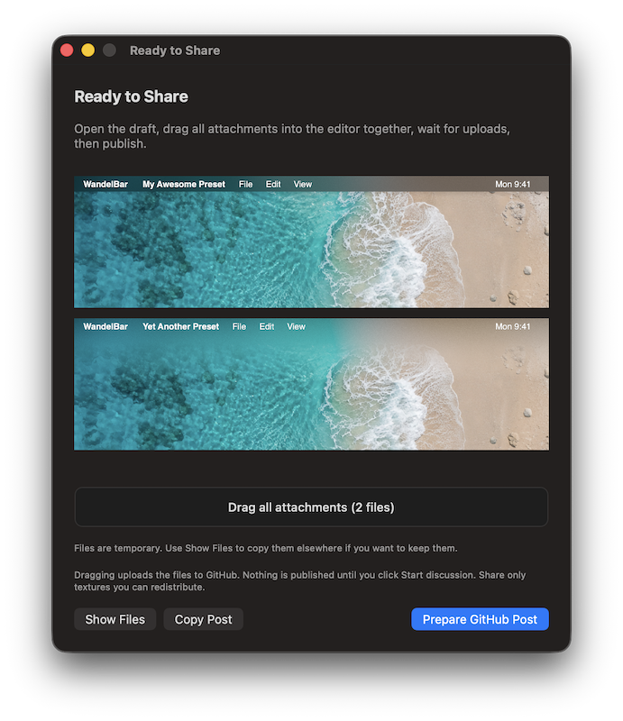

# Share presets

1. In the preset catalog's actions menu, choose **Share to Discussions…** and select personal presets.
2. Use the sample wallpaper, or enable **Use current wallpaper in previews**.
3. Prepare the share and click **Prepare GitHub Post**. Sign in to GitHub if needed.
4. Drag **all attachments** into the editor together and wait for the uploads to finish.
5. Review the post, preview and download link, then click **Start discussion**.

  

Custom textures travel with the package. Current-wallpaper mode includes your wallpaper in the
preview image, but not in the preset package. Share only images you are happy to publish and have
permission to redistribute. Previews are rendered by the app, not captured from your desktop.

## If you need the files or draft text

**Copy Post** copies the draft text if it did not transfer to GitHub. **Show Files** reveals the
attachments in Finder. They are temporary; copy them elsewhere if you want to keep them.

If GitHub displays the download link as plain text after an image, add a blank line between them,
or place the download link first.

## Add your package to the gallery

Publishing a post does not automatically list it in the app. Read the
[Community Gallery approval process](COMMUNITY.md#getting-listed).
